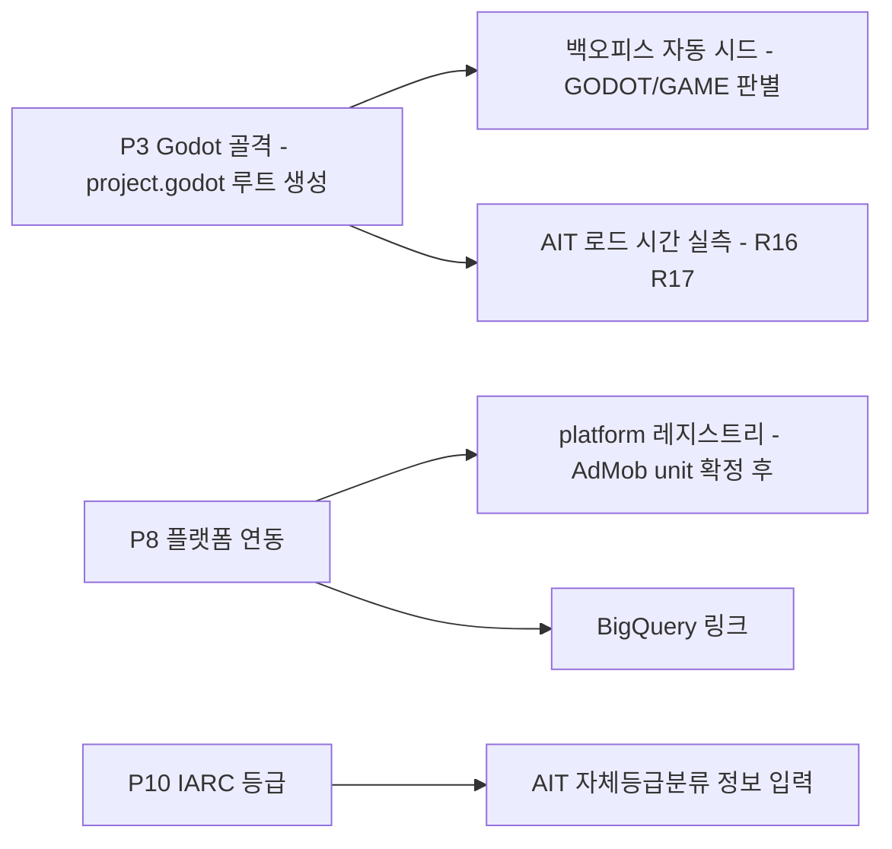

# P1 오프레포 프로비저닝 실행 기록

- 날짜: 2026-08-23
- 단계: P1 (오프레포 장기 리드)
- 관련: [[../game-design/decision-log]] · [[../game-design/06-technical-production-plan]]

## 완료

| # | 항목 | 결과 |
|---|---|---|
| 1 | GitHub 리포 생성 | `seorilabs/starlit-apprentice` (private). `main` + `feat/godot-rebuild-design-pack` push 완료 |
| 2 | GCP 프로젝트 | `starlit-apprentice`, 조직 `965953762431` 하위 |
| 3 | 과금 연결 | `01179A-37A44C-447C1D` |
| 4 | Firebase 활성화 | 완료 |
| 5 | GA4 속성 | `properties/551096427` (계정 `accounts/396259050`) |
| 6 | GA4 Web 스트림 | `measurement_id` 발급 완료 |
| 7 | MP api_secret | 발급 완료 |
| 8 | per-game 읽기 SA | `ga4-routine-ro@starlit-apprentice.iam.gserviceaccount.com` |
| 9 | **R4 — SA 키 파싱 검증** | **통과.** `type=service_account`, `private_key` 1,704자. 이 조직은 이전에 두 번 0바이트 키를 만든 전례가 있다 |
| 10 | **R3 — GA4 커스텀 측정기준** | **완료. 첫 이벤트 전송 전에 등록했다** |

값은 `~/.config/seorilabs/analytics-starlit-apprentice.env`에 있다(gitignore, 저장소에 커밋하지 않는다).

### 등록된 커스텀 측정기준 (전부 EVENT 범위)

| parameterName | displayName | 용도 |
|---|---|---|
| `platform` | App Platform | 마켓 분해. MP Web 스트림은 전 트래픽을 `platform=web`으로 뭉갠다 |
| `release_version` | Release Version | 앱 버전. Web 스트림에는 `app_version`이 없다 |
| `first_launch_day` | First Launch Day | 잔존율 재구성. MP가 `first_open`/`session_start`를 거부해 `newUsers`가 영구 0이다 |

> **소급 적용이 안 되는 유일한 항목이라 최우선으로 처리했다.** lizard-tycoon이 이 단계를 출시 후에 발견해 초기 500여 건의 마켓 분해를 영구히 잃었다.

## 의도적으로 하지 않은 것

| 항목 | 이유 | 언제 |
|---|---|---|
| **게임물 등급 신청** | 심사 제출은 외부 제출 행위다. 경로만 문서화했다 — Play/App Store IARC 취득 후 AIT 콘솔에 자체등급분류 정보 입력 | P10 |
| **백오피스 앱 등록** | **강제하면 안 된다.** 백오피스는 GitHub 리포에서 자동 시드하며 `project.godot` 유무로 엔진을 판별한다(`src/lib/seed/compute.ts:174-183`). 지금은 루트에 `package.json`이 남아 있어 **RN/APP으로 잘못 등록된다** | P3 이후 자동 |
| **platform 레지스트리 등록** | `features.ads=true`는 실제 AdMob unit ID·리워드 범위·일일 한도를 요구하는데 아직 없다. 또한 파일만 고치면 아무 일도 일어나지 않고 `regsync`를 사람이 따로 돌려야 한다 | P8 |
| **BigQuery 링크** | 잔존율 조회를 실제로 할 때 마무리한다. 현재 `bigQueryLinks`가 `{}`(미연결) — `bq ls`가 아니라 이 엔드포인트로 확인해야 한다 | P8 |
| **브랜치 보호 규칙** | 한 번도 보고된 적 없는 check 컨텍스트는 required로 걸 수 없다 | P9 |

## 다음 단계 의존성

