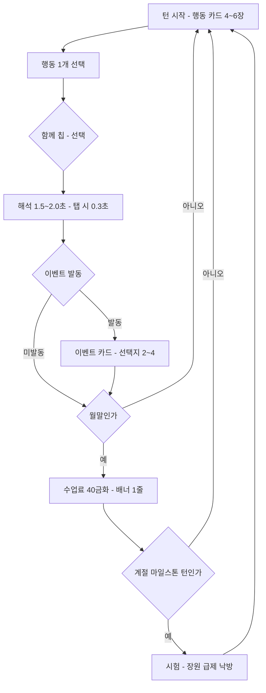

# 게임 디자인 문서

- 문서 상태: `draft`
- 작성일: 2026-08-23
- Source of truth: 이 문서가 코어 루프, 규칙, 수식, 상태 전이, 엔딩 판정, 콘텐츠 재고를 소유한다. 구현 순서는 승인된 계획 파일이 소유한다.
- 관련: [[00-product-brief]] · [[01-research-dossier]] · [[07-validation-rules]]

## 이 문서가 고치는 것

현행 구현의 실측 결함과 대응을 1:1로 건다. 각 항목의 근거는 `legacy/product-core-ts` 실측이다.

| # | 현행 결함 | 대응 절 |
|---|---|---|
| F1 | 실질 의사결정 12번 (월 4주 일괄 확정 후 변경 불가) | §1 |
| F2 | 선형 성장 → 주력 스탯 6~7개월차 100, 후반 24턴 사망 | §2 |
| F3 | 카테고리 내 비용 완전 동일 (수업 6종 = 1개 튜플) | §2.4 |
| F4 | 월말 무상 자원 + 무료 휴식 → 2개월차부터 기력 100·스트레스 0~4 고정 | §3 |
| F5 | 실패 상태 전무, 소프트락 불가능 = 리스크 없음 | §3.2 |
| F6 | 크리티컬이 실패보다 6.7배 잦음 (RNG가 보너스) | §3.3 |
| F7 | 이벤트 선택지 0개, 12번 중 4번만 발동, 전부 자동 성공 | §4 |
| F8 | `priority: 30` 3종이 26종을 가림 → 만렙이 항상 `court-scribe` | §6 |
| F9 | 30루트 중 13개가 시드로 엔딩이 뒤집힘 | §6.4 |
| F10 | `targetEndingCode`를 판정이 읽지 않음 | §6.3 |
| F11 | 총 텍스트 2,708자, 2회차 신규 약 2% | §8 |
| F12 | 메타 진행 전무 (모든 회차 동일 시작) | §7 |
| F13 | 스킵 안 하면 1회차 17분이 대기 | §1.2 |

## 경험 타임라인

| 구간 | 플레이어가 얻는 것 | 이 문서에서 보장하는 절 |
|---|---|---|
| **10초** | 별빛 아카데미의 밤하늘과 견습생이 보이고 행동 카드 4장 중 하나를 고른다 | 화면 계약 |
| **3분** | 3~4턴 진행, 스탯 상승, 첫 이벤트 선택지, 세라와 만남 | 코어 루프 · 콘텐츠 |
| **30분** | 1~2회차 완주, 엔딩 1~2종 도감 등록, 첫 각인 구매 | 인수 시나리오 · 메타 진행 |
| **7일** | 도감 8~12종, 진로 확장, NPC 2~3명 신뢰 이상, 선배 명부 축적 | 메타 진행 |

## 코어 루프

### 턴 구조

**12개월 × 3턴 = 36턴.** 턴 라벨은 상순 / 중순 / 하순.

> 장르 정본과 정렬: Princess Maker 2가 동일하게 한 달을 상순·중순·하순 3턴으로 나눈다. 우마무스메는 월 2턴 × 36개월 = 72턴. 현행의 "월 1회 4주 일괄 확정"은 두 정본 어디에도 없다. → [[01-research-dossier]] O1

각 턴은 **개별 확정·즉시 해석**한다. 월 일괄 확정과 7일 tick 루프는 삭제한다.



| 경계 | 횟수 | 내용 |
|---|---:|---|
| 턴 | 36 | 행동 1개 + 선택적 `함께` 수식 |
| 월말 | 12 | 수업료 40금화 청구. **화면 전환 없이 배너 1줄** |
| 계절 마일스톤 | 4 | 턴 9 / 18 / 27 / 36 |
| 진로 선언 | 1 | 월 7 시작, 필수 |

**실질 의사결정 = 36 주간 + 약 30 이벤트 선택 + 1 진로 선언 ≈ 67회.** (현행 12회 → F1 해소)

### 세션 길이

의사결정만으로는 36 × 5.5초 = 198초뿐이다. **세션의 약 60%를 저작된 서사 비트가 채운다.** 이것이 F11(콘텐츠 부족)과 세션 길이 목표를 한 번에 푸는 지점이다.

| 구간 | 횟수 | 단가 | 소계 |
|---|---:|---:|---:|
| 견습생 생성 + 재능 개봉 | 1 | 45초 | 45 |
| 주간 행동 결정 (판단 3.5초 + 연출 2.0초) | 36 | 5.5초 | 198 |
| 이벤트 카드 | 14 | 16초 | 224 |
| NPC 관계 장면 | 10 | 14초 | 140 |
| 계절 마일스톤 | 4 | 30초 | 120 |
| 상태이상 진입/해제 | 3 | 12초 | 36 |
| 진로 선언 | 1 | 30초 | 30 |
| 엔딩 + 도감 해금 + 공유 | 1 | 110초 | 110 |
| 전면 광고 (Android/iOS) | 1 | 20초 | 20 |
| 여유·메뉴·스탯 확인 | — | — | 97 |
| **합계** | | | **1,020초 = 17.0분** |

경계: 숙련 재플레이 14.2분 / 첫 플레이 22.4분. 불변식 14가 [840, 1260]초로 게이트한다.

**F13 해소**: `DAY_DURATION_MS = 3000` × 7일 × 48주 = 16.8분의 강제 대기를 삭제한다. 해석은 1.5~2.0초, 탭하면 0.3초. 일일 tick 모델 자체가 없어진다.

## 진행

### 스탯 14종 → 9종

현행 `magic`과 `courage`는 **소스 액션이 각각 1개뿐**이라(실측) 육성 대상이 아니라 병목이다. 통합한다.

| 신규 (9) | 흡수 | 대표 NPC |
|---|---|---|
| 지성 | intellect + focus | 세라 |
| 감성 | sensibility + creativity | 윤 |
| 예법 | etiquette + empathy | 모란 |
| 손재주 | craft | 구 노인 |
| 체력 | stamina | 구 노인 |
| 별감응 | magic | 세라 · 이든 |
| 담력 | courage | 이든 |
| 언변 | charm + leadership | 하린 |
| 상재 | business | 하린 |

**평판은 스탯 배열에서 분리한다.** 0~100의 사회 지표이며 이벤트·마일스톤·NPC·공개 업무로만 오른다. 현행에서 평판 엔딩이 단일 행동 25턴 반복을 요구하던 문제(실측)가 사라진다.

스탯 표시는 **9점 별자리(constellation) 레이더**다. 표가 아니다. → §10

### 성장 공식

```
gain = round(base × talent × tier × term × outcome × condition)
```

**base** — 티어별. F3(카테고리 내 무차별) 해소의 절반.

| 티어 | base | 해금 조건 |
|---|---:|---|
| 기초 | 8 | 항상 |
| 심화 | 11 | 해당 스탯 ≥ 40 **AND** 해당 계열 4회 |
| 비전 | 14 | 해당 스탯 ≥ 65 **AND** 담당 NPC 호감 ≥ 45 **AND** 월 ≥ 7 |

**talent** — 런당 고정 multiset을 9스탯에 시드 셔플.

| 등급 | S | A | A | B | B | B | B | C | D |
|---|---:|---:|---:|---:|---:|---:|---:|---:|---:|
| 배율 | 1.35 | 1.20 | 1.20 | 1.00 | 1.00 | 1.00 | 1.00 | 0.85 | 0.70 |

고정 multiset이라 **항상 강점 1개와 약점 1개가 보장**된다. 올S도 올D도 나오지 않는다. 배정 경우의 수 3,780.

**tier** — 체감 감소.

| 현재값 | 0–29 | 30–49 | 50–64 | 65–79 | 80–89 | 90–100 |
|---|---:|---:|---:|---:|---:|---:|
| 배율 | 1.00 | 0.85 | 0.70 | 0.55 | 0.38 | 0.20 |

**term** — 분기 상한. **F2 해소의 핵심 장치.**

| 분기 | 턴 | 상한 | 초과 시 |
|---|---|---:|---:|
| 1분기 (M1–3) | 1–9 | 50 | ×0.12 |
| 2분기 (M4–6) | 10–18 | 70 | ×0.12 |
| 3분기 (M7–9) | 19–27 | 88 | ×0.12 |
| 4분기 (M10–12) | 28–36 | 100 | — |

상한 초과분의 40%는 **숙련도**로 적립돼 다음 분기 첫 턴에 즉시 반영된다. 조기 과투자가 낭비가 아니라 비효율이 되게 한다.

**outcome** 실패 0.4 / 성공 1.0 / 대성공 1.8 / 각성 3.0
**condition** 호조 1.15 / 보통 1.00 / 부진 0.75 / 슬럼프 0.45

### 조기 캡 불가능 증명

최대 집중 플레이어(재능 B, 36턴 전부 동일 계열, 전부 성공, 보통 컨디션, 비전은 최단 해금 턴 19):

| 턴 | 시작 | tier | term | base | 획득 | 종료 |
|---:|---:|---:|---:|---:|---:|---:|
| 1–3 | 10.0 | 1.00 | 1.00 | 8 | +8.0 | 34.0 |
| 4 | 34.0 | 0.85 | 1.00 | 8 | +6.8 | 40.8 |
| 5 | 40.8 | 0.85 | 1.00 | 11 | +9.4 | 50.2 |
| 6–9 | 50.2 | 0.70 | **0.12** | 11 | +0.9 | **53.9** |
| 10–11 | 53.9 | 0.70 | 1.00 | 11 | +7.7 | 69.3 |
| 12 | 69.3 | 0.55 | 1.00 | 11 | +6.1 | 75.4 |
| 13–18 | 75.4 | 0.55 | **0.12** | 11 | +0.7 | **79.6** |
| 19 | 79.6 | 0.55 | 1.00 | 14 | +7.7 | 87.3 |
| 20 | 87.3 | 0.38 | 1.00 | 14 | +5.3 | 92.6 |
| 21–27 | 92.6 | 0.20 | **0.12** | 14 | +0.34 | **95.0** |
| 28–29 | 95.0 | 0.20 | 1.00 | 14 | +2.8 | **100** |

**어떤 스탯도 턴 29(월 10) 이전에 100에 도달할 수 없다 — 튜닝이 아니라 구조적으로.** 불변식 6이 이를 CI에서 강제한다.

분기 상한은 죽은 턴을 **전환 턴**으로 바꾼다. 상한을 넘긴 스탯의 턴 가치가 12%로 떨어지므로, 다른 스탯·NPC 호감·평판·골드로 옮기는 것이 정답이 된다.

**현실적 투자 곡선 (재능 B, 성공 기준)**

| 투자 턴 | 4 | 9 | 14 | 20 | 29 |
|---|---:|---:|---:|---:|---:|
| 도달값 | 41 | 50 | 76 | 88 | 100 |

엔딩 요건은 이 곡선에 맞춰 저작한다. band 3은 스탯 3개 70~80(약 30턴 소요) → **한 회차가 band 3 엔딩을 2개 넘게 만족할 수 없다.** 이것이 판정을 의미 있게 만든다. (현행은 한 회차가 29개 엔딩 조건을 전부 만족시킬 수 있었다)

### 액션 19종 → 38종, 비용 차등화

| 분류 | 개수 |
|---|---:|
| 수업 (6계열 × 3티어) | 18 |
| 일 | 6 |
| 외출 | 5 |
| 휴식 | 3 |
| 진로 전용 비전 | 6 |
| **합계** | **38** |

**F3 해소**: 현행은 수업 6종·일 6종·외출 4종이 각각 비용 튜플 **1개**로 완전 동일했다(실측). 계열별로 차등화한다.

| 행동 | 금화 | 기력 | 마음 |
|---|---:|---:|---:|
| 문장 기초 (지성) | −20 | −8 | +5 |
| 단련 기초 (체력) | −10 | −18 | +3 |
| 별빛 기초 (별감응) | −35 | −12 | +8 |
| 심화 (계열별 ±20%) | −45 | −16 | +10 |
| 비전 (계열별 ±20%) | −80 | −24 | +16 |
| 일: 잡일 | +18 | −12 | +8 |
| 일: 서기관 | +45 | −14 | +10 |
| 일: 공방 | +38 | −18 | +7 |
| 외출: 광장 | −12 | −5 | −10 |
| 휴식: 집 | 0 | +19+체력/6 | −16 |
| 휴식: 온천 | −50 | +30 | −30 |

같은 카테고리 안에서도 비용이 다르므로 **수업 6종 중 무엇을 고르는지가 경제 결정**이 된다.

## 경제

### 자원이 실제로 구속되게

시작값: 금화 **120** / 기력 **70** / 마음 **15** / 평판 **5**.

**F4 해소 — 무료 자원 제거**
- 월말 무상 `기력 +8 / 마음 −4` **삭제**
- **월납 수업료 40금화 × 12 = 480금화** 신설
- 휴식 회복량을 `18 + floor(체력/6)`로 체력 의존화 (체력 10 → +19, 체력 80 → +31)

**골드가 구속되는 근거**: 필수 학비 480 + 심화 12턴 540 = **1,020금화** 대 시작 120. 일 수입은 상재 30·하린 호감 40에서 38 × 1.2 × 1.2 = 55/턴. → **36턴 중 약 17턴을 일에 써야 하고, 이는 수업과 직접 경쟁한다.**

**빚**: 수업료 미납 시 발생. 매 턴 평판 −1, 일 수입 ×0.85. 해제는 상환 또는 모란 호감 ≥ 50(런당 1회). 골드를 구속시키되 소프트락은 만들지 않는다.

## 규칙과 상태 머신

### 상태이상 6종 — F5 해소

| 상태 | 진입 | 효과 | 해제 |
|---|---|---|---|
| 부진 | 같은 계열 3연속 실패 **또는** 마음 ≥ 70이 2턴 | condition ×0.75, 마음 +2/턴 | 휴식 2턴 / NPC 격려 이벤트 / 대성공 1회 |
| 슬럼프 | 부진 3턴 지속 **또는** 마음 ≥ 90 | condition ×0.45, **심화·비전 잠금** | 휴식 3턴 / 온천 50금화 / 세라 호감 ≥ 40 자동(런당 1회) |
| 부상 | 기력 ≤ 10에 체력·담력 행동 (35% 판정) **또는** 심화·비전 체력 실패 | 체력 −6, 체력 행동 3턴 잠금, 기력 상한 70 | 3턴 자동 / 치료 80금화로 1턴 |
| **번아웃** | 마음 ≥ 95 | **강제 2턴 소모 — 선택권 상실**, 마음 −40, 기력 +30, 평판 −8 | 자동 |
| 평판 추락 | 평판이 20 이상이었다가 0 도달 | 전 NPC 호감 −10, 일 수입 ×0.7 (4턴) | 평판 ≥ 15 |
| **낙제** | 계절 마일스톤 2회 낙방 | **band ≥ 4 엔딩 이번 런 영구 잠금** | 없음 |

**번아웃이 진짜 이빨이다** — 36개 의사결정 중 2개를 플레이어 입력 없이 소모한다.
**낙제가 엔딩 잠금이다** — 현행에 존재하지 않던 것.

**소프트락 불가능 보장**: `집에서 쉬기`(0금화)와 `잡일`(+18금화)은 자원 상태와 무관하게 **항상 선택 가능**하다. 36턴은 언제나 해석된다. 다만 런은 **band 0 실패 엔딩 3종**으로 끝날 수 있다.

> 실패 엔딩은 벌칙이 아니라 콘텐츠다. 장르에서 "파라미터가 바닥나거나 편중되어 발생하는 엔딩이 정규 엔딩보다 인기 있는 경우가 많다"(→ [[01-research-dossier]] O5).

### RNG — F6 해소

**336롤 → 36롤** (턴당 1회). 실패 가중으로 뒤집는다.

```
fail = clamp(0.06 + 마음/260 + (60 − 기력)/500 + tier_penalty − talent_bonus, 0.03, 0.45)
crit = clamp(0.10 + 기력/900 − 마음/700 + 호감/1250 + talent_bonus, 0.04, 0.30)
```

- `tier_penalty`: 기초 0 / 심화 +0.05 / 비전 +0.12 → **티어가 상위호환이 아니라 결정이 된다**
- `talent_bonus`: S +0.06 / A +0.03 / B 0 / C −0.03 / D −0.06

| 상황 | fail | crit | 비 |
|---|---:|---:|---|
| 중간값 (마음 40, 기력 60, 기초, B) | 21.4% | 11.0% | 실패 1.9배 |
| 관리 우수 (마음 15, 기력 85, 기초, A) | 3.8% | 20.0% | 대성공 5.3배 |
| 무리 (마음 80, 기력 25, 비전, C) | 45.0% | 4.0% | 실패 11배 |

현행은 336롤에서 실패 4.2% / 크리티컬 28%로 **크리티컬이 6.7배 잦았다**(실측). 이제 중앙값에서 실패가 더 잦고, 관리를 잘하면 상승으로 뒤집힌다.

배율도 (0.25×, 2.0×) → **(0.4×, 1.8×)**로 좁혀 시드 간 분산을 줄인다. F9(시드 불안정) 대응의 일부다.

**각성**: 대성공 시 2% 확률로 gain ×3.0 **및 해당 스탯 재능 등급 +1 영구**. 런당 1회. 기억에 남는 순간 생성기.

### 계절 마일스톤 — 자동 통과 콘테스트 대체

현행 콘테스트 판정은 `bestStat + reputation + energy − stress >= 85`인데 기력이 100에 고정되므로 **3개월차부터 자동 통과**한다(실측). 판정이 아니라 예약된 보상이었다.

```
score      = 대표계열스탯 + 평판×0.5 + (진로 일치 ? 10 : 0) + NPC_지원 + d20(seed)
difficulty = [55, 78, 98, 118][분기]
등급        = 장원 (≥ diff+20) / 급제 (≥ diff) / 낙방 (< diff)
```

| 플레이 유형 | S1 | S2 | S3 | S4 |
|---|---|---|---|---|
| 특화 | 급제 73/55 | 장원 | 장원 143/98 | 장원 |
| 균형 | 급제 58/55 | 급제 | 급제 110/98 | 급제 |
| 방치 | **낙방** 40/55 | 낙방 | **낙방** 75/98 | 낙제 확정 |

`d20`은 ±10만 기여한다 — 양념이지 진로 결정자가 아니다.

## 콘텐츠

### 이벤트 스키마 — F7 해소

현행 `GameEvent`는 `{id, title, body, effects}`이고 **`choices` 필드가 코드베이스 어디에도 없다**(실측).

```gdscript
# packages/product-core/src/domain/game_event.gd  (extends RefCounted)
{
  id: String, category: String,      # opening|seasonal|npc|condition|opportunity|world|path|finale
  title: String,                     # 한글 6~14자
  body: String,                      # 한글 60~140자
  art_key: String, weight: int,
  once_per_run: bool, cooldown_turns: int,
  requirements: Array,               # stat|resource|reputation|flag|flag_sum|affinity|
                                     #   npc_met|turn_range|condition|declared_path
  exclusions: Array,
  choices: Array                     # EventChoice[], 2~4개
}

# event_choice.gd
{
  id: String, label: String,         # 한글 8~20자
  requirements: Array,
  locked_reason: String,             # 미충족 시 회색 + 사유 노출 (숨기지 않는다)
  cost: { gold, energy, stress, turn_skip },
  check: null | { stat, difficulty, npc_id, affinity_weight },
  outcomes: Array                    # 1개(확정) 또는 2개(성공/실패)
}

# event_outcome.gd
{
  kind: String,                      # only|success|failure
  weight: int,
  result_text: String,               # 한글 40~90자 — 분기마다 반드시 다른 문장
  effects: { stats, gold, energy, stress, reputation,
             flags, affinity, condition, unlock }
}
```

판정: `p_success = clamp(0.15 + (stat − difficulty)/100 + 호감/300, 0.05, 0.95)`

**미충족 선택지는 숨기지 않고 회색 + 사유를 노출한다.** 이것이 호감·스탯 임계값을 학습시키고 재플레이 콘텐츠를 광고한다.

### 볼륨과 트리거

| 풀 | 저작 | 트리거 | 런당 발동 |
|---|---:|---|---:|
| 개막 | 3 | 턴 1, 재능 프로필로 1개 | 1 |
| 계절 마일스톤 | 8 | 턴 9/18/27/36, 대표 계열로 분기 | 4 |
| NPC 관계 | 36 | 6명 × 호감 20/35/50/65/80 도달 | 6–10 |
| 조건(상태이상) | 12 | 6개 상태 × 진입/해제 | 2–5 |
| 기회 | 24 | 3턴 중 1턴 가중 추첨, 쿨다운 4 | 8–11 |
| 세계(플레이버) | 16 | 비이벤트 턴 가중 추첨 | 4–6 |
| 진로 선언 | 1 | 월 7 시작 | 1 |
| 종막 | 6 | 턴 36, 엔딩 band로 분기 | 1 |
| **합계** | **106** | | **27–33** |

현행은 12번 중 **4번만** 발동하고 전부 콘테스트·전부 성공이었다(실측).

### 회차 간 서사 차별화

**기회 이벤트 24개를 시드로 서로 겹치지 않는 3개 덱(각 8개)으로 분할한다.** 한 런은 1개 덱 + 와일드카드 2개를 뽑는다. → **런 1·2·3은 기회 이벤트가 하나도 겹치지 않는다.**

NPC 이벤트는 누구를 만났는지에, 계절 이벤트는 대표 계열에, 조건 이벤트는 무너졌는지에 의존한다. 연속 두 회차의 실질 발동 이벤트 중복률 **35~45%** (현행 사실상 100%).

### 표본 이벤트

#### `opp.night-market-ledger` — 기회, weight 8, 쿨다운 4, `turn_range 8..26`

> ### 밤시장의 장부
>
> 해질녘 시장 한 귀퉁이에서 늙은 상인이 장부를 앞에 두고 쩔쩔맨다. "숫자가 자꾸 어긋나는데, 눈이 침침해서 원…" 지나가던 견습생을 붙잡고 도와줄 수 있겠냐 묻는다. 오늘 밤은 길어질 것 같다.

| 선택지 | 조건 | 비용 | 판정 |
|---|---|---|---|
| 밤새 장부를 맞춰 준다 | — | 기력 −14, 마음 +8 | 상재 vs 35 |
| 셈이 빠른 친구를 데려온다 | 하린 호감 ≥ 25 | 마음 +2 | 없음 |
| 미안하다고 말하고 지나간다 | — | — | 없음 |

- **성공** — *"새벽녘, 어긋난 숫자 한 줄을 찾아냈다. 상인은 말없이 은화 한 줌과 함께 시장 사람들에게 견습생의 이름을 알렸다."* → 상재 +7, 금화 +90, 평판 +6, `flag opp.ledger_solved`
- **실패** — *"숫자는 끝내 맞지 않았다. 그래도 상인은 식은 국밥 한 그릇을 내밀었다. '고맙네. 젊은 눈도 별수 없구먼.'"* → 상재 +3, 금화 +20, 기력 −6
- **친구** — *"하린은 촛불 두 개를 켜 두고 반 시간 만에 장부를 정리했다. 상인은 두 사람 몫의 사례를 건넸고, 하린은 제 몫을 견습생 손에 쥐여 주었다."* → 상재 +4, 금화 +60, 평판 +3, 하린 +8
- **거절** — *"등 뒤로 장부 넘기는 소리가 오래 남았다. 오늘은 별을 볼 시간이 생겼다."* → 마음 −5, 기력 +4

#### `npc.rival.eden.02` — NPC, `affinity(이든) ≥ 30`, `turn ≥ 12`, `once_per_run`

> ### 같은 밤을 새운 사람
>
> 천문탑 계단참에서 이든과 마주쳤다. 손에는 견습생이 사흘째 붙들고 있던 바로 그 관측표가 들려 있다. "네가 먼저 볼 줄 알았는데." 웃는 것도 비웃는 것도 아닌 얼굴로 이든이 관측표를 내민다.

| 선택지 | 조건 | 비용 | 판정 |
|---|---|---|---|
| "같이 보자" 하고 옆에 앉는다 | — | 기력 −10, 마음 −4 | 없음 |
| "먼저 봤으면 먼저 풀어야지" | — | 기력 −6 | 담력 vs 40 |
| 아무 말 없이 계단을 내려간다 | — | — | 없음 |

- **동행** — *"두 사람은 새벽까지 같은 표를 두 번 읽었다. 서로 다른 곳에서 같은 오류를 짚어 냈을 때, 이든이 처음으로 소리 내어 웃었다."* → 별감응 +6, 지성 +4, 이든 +12, `flag npc.eden_ally`
- **경쟁 성공** — *"이든은 표를 순순히 넘겼다. 다음 날 아침, 견습생의 이름이 관측 기록 맨 윗줄에 적혔다. 이든은 그날 하루 종일 말이 없었다."* → 별감응 +9, 평판 +7, 이든 −6, `flag npc.eden_rivalry`
- **경쟁 실패** — *"표를 잡아채려다 그대로 놓쳤다. 흩어진 종이를 줍는 동안 이든은 팔짱을 낀 채 기다려 주었다. 그게 더 아팠다."* → 마음 +10, 이든 −10, 부진 진입 판정
- **회피** — *"등 뒤에서 종이 넘기는 소리가 났다. 오늘 밤 천문탑은 이든의 것이다."* → 이든 −4, 마음 +3

> `npc.eden_ally`와 `npc.eden_rivalry`는 **둘 다 유효한 분기**이고 각각 다른 band-3 엔딩으로 간다. 죽은 구간은 **중간** — 이든을 아예 무시하는 것이다.

#### `cond.burnout.enter` — 조건, `마음 ≥ 95`

> ### 손이 멈춘 아침
>
> 눈을 떴는데 몸이 일어나지지 않는다. 창밖은 이미 환하고, 오늘 해야 할 일이 머릿속에 줄줄이 떠오르는데도 손끝 하나 움직일 마음이 나지 않는다. 스승이 문을 두드리다가, 그냥 돌아갔다.

| 선택지 | 조건 | 비용 |
|---|---|---|
| 이불 속에서 이틀을 보낸다 | 항상 가능 (soft-lock 방지) | `turn_skip 2` |
| 스승에게 편지를 쓴다 | 세라 호감 ≥ 40 | `turn_skip 1` |
| 약을 사서 버틴다 | 금화 ≥ 120 | 금화 −120, `turn_skip 0` |

- **이틀** — *"이틀 뒤, 창을 열자 바람이 방 안으로 들어왔다. 잃어버린 것은 이틀뿐이라고, 스스로에게 말해 본다."* → 마음 −45, 기력 +35, 평판 −8, 해제
- **편지** — *"다음 날 아침, 문 앞에 따뜻한 죽 한 그릇과 짧은 쪽지가 놓여 있었다. '쉬는 것도 수련이다.' 글씨가 평소보다 크고 둥글었다."* → 마음 −40, 기력 +28, 세라 +10, 해제
- **약** — *"약기운으로 하루를 버텼다. 몸은 움직였지만, 그날 배운 것은 하나도 기억나지 않았다."* → 마음 −25, 기력 +10, 체력 −5, 해제, `flag cond.medicated`

> NPC 투자의 보상이 여기서 드러난다. 세라 호감 40이 36턴 중 1턴을 되사 준다.

## NPC 관계

### 등장인물 6명

| ID | 이름 | 역할 | 담당 계열 | 만남 |
|---|---|---|---|---|
| `sera` | 세라 | 스승 | 지성 · 별감응 | 턴 1 고정 |
| `eden` | 이든 | 라이벌 | 별감응 · 담력 | 턴 4 고정 |
| `harin` | 하린 | 동기 | 상재 · 언변 | 턴 6–9 이벤트 |
| `moran` | 모란 | 후원자 | 예법 · 평판 | 평판 ≥ 25 |
| `gu` | 구 노인 | 장인 | 손재주 · 체력 | 일 6회 이후 |
| `yun` | 윤 | 떠돌이 | 감성 · 담력 | 외출 4회 이후 |

호감 0~100. 밴드: 낯섦(0–19) / 안면(20–39) / 친분(40–59) / 신뢰(60–79) / 각별(80–100).

### 호감 획득 — 의사결정 비용을 늘리지 않는다

이것이 설계 제약이다. 36턴짜리 런에 NPC 관리라는 두 번째 결정 축을 얹으면 세션이 무너진다. 채널 4개 중 3개가 **무료**다.

1. **행동에 붙은 패시브 라이더 (클릭 0회)** — 모든 행동에 `npc_tag`가 있다. 수행 시 해당 NPC **+2** (대성공 +3, 실패 0). 지성 12턴 특화면 세라가 추가 조작 없이 약 26에 도달한다.
2. **이벤트 선택지 (클릭 0회 추가)** — 지배적 레버. NPC 우호 선택지가 **+8 ~ +14**. 이미 하던 선택이다.
3. **`함께` 수식 — 유일한 신규 어포던스.** 행동 화면에 NPC 초상 칩이 0~2개 뜬다(NPC별로 런당 2~3턴만 등장). 확정 **전에** 칩을 탭하면 마음 +4, 호감 +10, 스탯 획득 ×1.25, 대성공 +0.06. **36턴 중 약 8턴에서 1탭 추가.**
4. **감소** — 실패 −1 / 부진·슬럼프 진입 시 스승 −3 / NPC 이벤트 거절 −4~−10 / 평판 추락 시 전원 −10 / 10턴 연속 무시 −5(하한 20, 만난 NPC 한정).

### 호감이 여는 것

| 게이트 | 필요 호감 | 왜 중요한가 |
|---|---:|---|
| **비전 티어 해금** | 45 (계열 담당) | 최상위 성장 티어의 유일한 열쇠 |
| NPC 이벤트 체인 | 20/35/50/65/80 | 전체 이벤트의 34% (36/106) |
| **NPC 전용 엔딩 6종** | 80 + 스탯·플래그 | band 3~4에 배치 |
| 슬럼프 자동 회복 | 세라 40 | 런당 1회, 턴 2개 절약 |
| 빚 청산 | 모란 50 | 런당 1회 |
| 부상 기간 단축 | 구 노인 50 | 3턴 → 2턴 |
| 일 수입 배율 | 하린 `×(1 + 호감/200)` | 경제 직결 |
| 마일스톤 지원 점수 | 전원 합산 | 시험 통과 보조 |

### 라이벌 분기

**이든만** 두 개의 유효 종착점을 갖는다.

| 종착 | 조건 | 이어지는 엔딩 |
|---|---|---|
| 동맹 | 호감 ≥ 65 | band 3 (공동 연구 계열) |
| 경쟁 | 호감 ≤ 25 **AND** 경쟁심 ≥ 4 | band 3 (단독 명성 계열) |
| **죽은 구간** | 호감 30~60 | 어느 쪽에도 도달하지 않음 |

이 게임에서 **낮은 호감이 정당한 전략인 유일한 관계**다.

## 엔딩 판정

### 현행 결함

현행 `judgeEnding`은 `(right.priority ?? right.index) - (left.priority ?? left.index)`로 정렬한다. 암묵 우선순위 최대치가 28인데 `court-scribe`·`royal-diplomat`·`spellwright` 3종이 `priority: 30`을 하드코딩한다. **29개 엔딩 조건을 전부 만족하는 만렙 런을 판정시키면 항상 `court-scribe`가 나온다**(실측). 잘할수록 배열 인덱스 2번으로 수렴한다.

### 특이도 점수 판정

> 장르 정본과 정렬: Princess Maker 1은 엔딩 30종을 **"최고 파라미터 + 종합 평가 점수"**로 판정한다(평가 ≥1200이면 무조건 여왕 엔딩). 점수 판정이 원형이고, 배열 인덱스 우선순위는 이 게임의 발명이다. → [[01-research-dossier]] O2

```
# 1) 자격
eligible = 모든 요건을 만족하는 엔딩 + [조용한_일상]   # 폴백은 항상 자격 있음

# 2) 특이도 — 콘텐츠에서 유도, 배열 위치와 무관
specificity(e) = Σ requirement_weight(r) + e.band × 3.0

  stat        → max(0, target − 10) / 10     # 지성 ≥ 80  → 7.0
  resource    → target / 100                 # 금화 ≥ 500 → 5.0
  reputation  → target / 8                   # 평판 ≥ 60  → 7.5
  flag        → target × 1.5                 # 별빛학 5회 → 7.5
  flag_sum    → target × 1.2
  affinity    → target / 8                   # 호감 ≥ 80  → 10.0
  condition   → 4.0                          # 예: 낙제 없음
  declared    → 6.0

margin(e)       = Σ clamp((현재 − 목표) / max(목표,1), 0, 0.5)
target_bonus(e) = 12.0  if e.code == run.declared_path_ending else 0.0

score(e) = specificity(e) + margin(e) × 2.0 + target_bonus(e)

# 3) 결정론적 정렬 — 시드·배열 위치와 무관
정렬: score desc → specificity desc → band desc → code asc
```

최종 타이브레이크가 **코드 문자열 사전순**이라 시드와 배열 위치 양쪽에서 독립이다.

**검증 예 (현행 데이터 기준)**

| 엔딩 | 요건 | specificity | band | 총점 |
|---|---|---:|---:|---:|
| 궁정 서기관 | 지성 60, 예법 55, 평판 35 | 5.0+4.5+4.375 = 13.9 | 2 (+6.0) | **19.9** |
| 왕국 외교관 | 예법 75, 언변 60, 평판 45 | 6.5+5.0+5.625 = 17.1 | 3 (+9.0) | **26.1** |

둘 다 만족하면 왕국 외교관이 나온다 — **요건이 객관적으로 더 높기 때문이지, 누가 `priority: 30`을 타이핑해서가 아니다.**

### `targetEndingCode`를 실제 기능으로 — F10 해소

3단계로 걸어, 가장 강한 단계가 하드 요건이다.

1. **판정 보너스 `+12.0`** — 선언한 목표가 동점 이웃을 이긴다. F9의 `별의 사제 → 천문대장` 뒤집힘이 플레이어 통제로 넘어온다.
2. **월 7 시작 진로 선언 이벤트 (필수)** — 현재 프로필로 3개 경로 제시. 선언 시 `진로 집중`(해당 계열 +10%)과 **전용 비전 액션 해금**. 이후 변경은 평판 −15와 보너스 상실.
3. **band ≥ 3 엔딩 전부가 `{type: "declared", path: ...}` 하드 요건을 갖는다** → **희귀·전설 엔딩은 선언 없이 도달 불가능하다.**

### 시드 안정성 — F9 해소

| 원인 | 조치 |
|---|---|
| RNG가 인접 엔딩 사이를 결정 | `declared` 하드 요건 + `target_bonus`로 플레이어가 결정 |
| 336롤 × (0.25×, 2.0×) 큰 분산 | 36롤 × (0.4×, 1.8×)로 표준편차 축소 |
| 마일스톤이 자동 통과 | d20이 ±10만 기여, 나머지는 스탯·평판·NPC |
| 검증이 시드 1개(`createNewRun(1)`)뿐 | **7개 고정 시드** 스윕 (불변식 7) |

### 섀도잉 금지 — 빌드 타임 린트

다음이면 CI 실패:
- 엔딩 A의 요건 집합이 B의 **진부분집합 상위**인데 `specificity(A) ≤ specificity(B)` (A가 영원히 도달 불가)
- 두 엔딩의 요건 집합이 **동일**

F8을 밸런스 사고가 아니라 **컴파일 에러**로 만든다.

### 엔딩 30종 재배치

| band | 이름 | 개수 | 요건 성격 |
|---:|---|---:|---|
| 0 | 실패 | 3 | 낙제한 견습생 / 빚에 쫓긴 견습생 / 조용한 일상 |
| 1 | 일상 | 5 | 단일 스탯 45–55 |
| 2 | 전문 | 10 | 스탯 2개 60–70 + 플래그 |
| 3 | 희귀 | 8 | 스탯 3개 70–80 + **진로 선언** + 평판 |
| 4 | 전설 | 4 | 스탯 85–90 + **NPC 호감 80** + 진로 + 무낙제 |

band 3·4 중 **6개는 NPC 전용 엔딩**(NPC 1명당 1개). 기존 30종의 테마(마법 아카데미 진로군 — 별빛 연구자, 궁정 서기관, 공방 장인, 무대 예술가, 도시 상인 등)는 **자산으로 보존**하고 요건만 재저작한다.

> **분량 배분 경고**: 경쟁작 서사가 약 220쪽인데 우리는 약 38쪽이다([[01-research-dossier]] W1). 엔딩 30종에 균등 배분하지 않고 **band 2~4에 집중**한다. band 0~1은 짧고 강하게 쓴다.

## 메타 진행 — 별빛 기록 (F12 해소)

현행 `createNewRun`은 도감을 읽지 않아 모든 회차가 동일하다(실측). 3개 채널을 만든다.

**1. 엔딩 도감 → 진로 해금**
엔딩을 열면 그 진로가 월 7 선언 메뉴에 영구 추가된다. 런 1은 범용 3경로, 런 10쯤 약 12경로.
**첫 런은 게이트되지 않는다** — 범용 3경로로 band ≤ 2를 전부 도달할 수 있다.

**2. 별조각 → 각인**
```
별조각 = 10 + 3×(신규 엔딩) + 2×(신뢰 이상 NPC) + 5×(낙제 없음)   # 런당 18~35
```

| 각인 | 비용 | 효과 |
|---|---:|---|
| 초심의 각인 | 20 | 시작 재능 1개를 직접 지정 |
| 곳간의 각인 | 30 | 시작 금화 +80 |
| 인연의 각인 | 40 | 시작 NPC 1명 호감 +20 |
| 별의 각인 | 60 | 각성 확률 2% → 5% |
| 스승의 각인 | 80 | 비전 해금 호감 45 → 35 |
| 두 번째 별 | 120 | 런당 1회 턴 되감기 |

**동시 3개만 장착.** 총 메타 파워 상한 **약 +15%** — 의도적으로 낮다. 런 1과 런 20이 모두 클리어 가능해야 하고, "진짜 게임을 하려면 5회차를 갈아야 한다"가 되면 안 된다.

> 선례: 수험생 키우기가 대학 배지 영구 패시브 + 프리셋 계승으로 재플레이를 지탱한다([[01-research-dossier]] O3).

**3. 견습생 명부**
끝낸 런마다 이름과 엔딩을 가진 견습생이 남는다. **런 3부터** 이전 견습생 1명이 `선배` NPC로 등장하고, 그의 최종 스탯이 교습 보너스가 된다. **추가 저작 비용 0**이면서 런 12가 런 2와 기계적으로 달라진다.

**회차 다양성 조합**

| 축 | 경우의 수 |
|---|---:|
| 재능 배정 (고정 multiset 셔플) | 3,780 |
| 기회 이벤트 덱 | 3 |
| NPC 만남 순서 | ≈ 24 |
| 월 7 선언 가능 경로 | 3 → 30 (누적) |
| 각인 3/6 조합 | 20 |
| 선배 명부 | 누적 |

## 콘텐츠 재고

| 항목 | 문자열 | 평균 자수 | 소계 |
|---|---:|---:|---:|
| 스탯 이름 + 설명 | 18 | 32 | 288 |
| 액션 (라벨·장소·설명) | 38 | 52 | 1,976 |
| 액션 결과 대사 (실패/성공/대성공/각성) | 152 | 26 | 3,952 |
| **이벤트 본문** | **106** | **110** | **11,660** |
| 이벤트 제목 | 106 | 9 | 954 |
| **이벤트 선택지 라벨** | **286** | **13** | **3,718** |
| **선택지 결과문 (분기 포함)** | **429** | **62** | **26,598** |
| NPC 프로필 | 6 | 120 | 720 |
| NPC 밴드 전환 대사 | 30 | 45 | 1,350 |
| 상태이상 진입/유지/해제 | 18 | 55 | 990 |
| 계절 마일스톤 결과 (8 × 3등급) | 24 | 70 | 1,680 |
| 진로 선언 (6경로) | 12 | 60 | 720 |
| **엔딩 (제목·요약·본문·공유문)** | **30** | **335** | **10,050** |
| 엔딩 힌트 / 미해금 문구 | 30 | 35 | 1,050 |
| 주간 요약 노트 | 40 | 34 | 1,360 |
| 튜토리얼 / FTUE | 24 | 38 | 912 |
| UI 라벨·버튼·토스트 | 160 | 7 | 1,120 |
| 각인 / 메타 설명 | 12 | 45 | 540 |
| 오류·복구·광고 문구 | 22 | 30 | 660 |
| **합계** | **~1,620** | | **~70,300** |

| 지표 | 현행 | 개편 후 | 배수 |
|---|---:|---:|---:|
| 총 한글자 | 2,708 | ~70,300 | **26.0×** |
| 문자열 수 | 238 | ~1,620 | 6.8× |
| 1런 노출량 | ~1,100자 | ~10,500자 | 9.5× |
| **2회차 신규 비율** | **~2%** | **~55%** | — |

**저작 예산 약 28일** (2,500자/일 + QA). **이벤트 42,000자가 전체의 60%이자 최장 경로**다.

## 온보딩

첫 5분에 4개 기둥을 순서대로 노출한다. 별도 튜토리얼 화면 없이 **첫 3턴의 콘텐츠로** 가르친다.

| 시점 | 가르치는 것 | 방법 |
|---|---|---|
| 턴 0 | 판타지 | 견습생 생성 + 재능 개봉 (S/D 등급을 시각으로) |
| 턴 1 | P1 선택이 남는다 | 개막 이벤트가 재능에 맞춰 분기. 첫 행동 후 별자리 점이 발광 |
| 턴 2 | P2 사람이 있다 | 세라가 `함께` 칩으로 등장 — 첫 1탭 추가 어포던스 |
| 턴 3 | 비용 구조 | 금화가 처음 눈에 띄게 줄고, 일 카드가 대비된다 |
| 턴 4 | P2 라이벌 | 이든 등장 |
| 월 1 말 | 구속 | 수업료 40금화 청구 배너 |
| 턴 9 | P3 잘못될 수 있다 | 첫 계절 마일스톤 — 방치 플레이는 여기서 실제로 낙방한다 |

## 화면 계약 — 대시보드 금지

> org 하드 게이트: "메인 플레이 화면은 장르의 판타지와 행동 결과가 먼저 보여야 한다. 숫자 카드와 관리 패널이 화면을 지배하는 simulator/dashboard 구성을 기본값으로 쓰지 않는다."
> 현행 구현은 정확히 이 금지된 레이아웃이다 — 14개 스탯 카드 그리드.

| 우선순위 | 영역 | 비중 | 내용 |
|---:|---|---:|---|
| 1 | **장면** | 상단 62% | 플랫 일러스트 배경, 견습생 피겨(대기→행동→결과), 현장 NPC 피겨, 계절 색조. 시기는 프로그레스 바가 아니라 **손글씨 명패** |
| 2 | **선택 밴드** | 하단 30% | 일러스트 행동 카드 4~6장. **카드당 숫자 최대 2개** (주 스탯 델타 + 기력 비용)를 아이콘+숫자 쌍으로만 |
| 3 | **자원 핍** | 우측 가장자리 | 금화·기력·마음 일러스트 토큰 + 견습생 초상. **초상의 표정이 마음 수치의 1차 표시** |
| — | 스탯 시트 | 초상 1탭 뒤 | **9점 별자리 레이더** — 표가 아니라 성도 |

**해석 비트 (1.5~2.0초, 탭 시 0.3초)**
카메라 push-in → 행동 비트 1회 → 해당 별자리 점 발광 → 숫자 하나 팝 → 결과 문장이 장면 위에 타이핑.
**화면 전환 없음.** 이것이 게이트가 요구하는 "행동 인과"다.

삭제되는 것: 14개 스탯 카드 그리드, "결과 보기" 스킵 버튼, 21초 타이머, 델타를 칩과 바로 두 번 보여주던 결과 화면.

## 수익화

**Android / iOS 한정.** AppsInToss 웹 빌드는 `ads_available = false`이고 `packages/product-core`는 광고 SDK를 import하지 않는다. (정책상 AIT 광고는 허용되나 Godot Web에 네이티브 경로가 없다 — [[01-research-dossier]] D1)

| 지면 | 형식 | 빈도 |
|---|---|---|
| 두 번째 별 — 현재 턴 결과 재굴림 | 보상형 | 런당 최대 2회 |
| 런 종료 시 별조각 +50% | 보상형 | 런당 1회 |
| 이번 런 한정 각인 슬롯 3 → 4 | 보상형 | 런당 1회 |
| 엔딩 공유 직후 | 전면 | 런당 정확히 1회, **2런당 1회로 제한** |

**원칙: 광고는 진행을 막지 않는다.** 기력 게이트도, 대기 타이머도 없다. 광고는 전부 **선택적 이득**이다. (경쟁작도 기력 게이트가 없다 — [[01-research-dossier]] O6)

**AppsInToss 광고 정책 준수** (AIT에 광고를 붙이게 될 경우 — S1 원문):
- 인트로/로딩/컷신/팝업 모달에 노출 금지
- 배너는 상단 또는 하단만
- 광고 재생 시 음악 일시정지, 종료 후 재개
- **사전 로딩 필수**
- 리워드 완주 시 보상 정상 지급

**보상 지급 규칙**: 네이티브 콜백은 힌트일 뿐이다. **Platform claim이 `server_verified`일 때만 보상을 지급한다.**

## 소셜 또는 오프라인 경계

- **완전 오프라인 플레이 가능.** 게임 규칙·저장·엔딩 판정은 네트워크를 요구하지 않는다.
- 네트워크를 쓰는 것은 두 가지뿐이다: GA4 분석 이벤트 전송(실패 시 `user://` 큐에 적재 후 재시도), 광고 로드(Android/iOS).
- **소셜 기능 없음** — 랭킹, 친구, 길드, 실시간 대전 모두 범위 밖이다.
- 공유는 엔딩 카드 1종. OS 공유 시트로 텍스트 + 딥링크를 내보낸다. 공유 링크로 들어온 사람은 **해당 엔딩 카드만** 보고, 도감이나 저장에는 영향을 주지 않는다.
- 서버 권위 없음. 저장은 기기 로컬 1슬롯이며 계정 이전 경로가 없다.

## 저장과 리셋 계약

- 저장 슬롯 1개 + 도감/메타(별조각·각인·명부)는 별도 키.
- 저장 시점: 턴 해석 후, 이벤트 해결 후, 월 경계, 엔딩.
- 스키마 버전 명시 + **실제 마이그레이션 함수**. 현행은 버전 필드만 있고 마이그레이션 코드가 없어 스키마 변경 시 런이 조용히 소실된다.
- 손상 시: 검증 실패 필드만 클램프하고 복구 가능한 접두사까지 되감는다. 전체 폐기 전에 사용자에게 알린다.
- **AppsInToss 요구사항**: 사용자 식별키로 플레이 기록이 유지되어야 하고, 미니앱 종료 후 재접속에도 데이터가 남아야 한다(S1).

## 인수 시나리오

| # | 시나리오 | 통과 조건 |
|---|---|---|
| AC-001 | 신규 플레이어가 36턴을 완주한다 | 12~25분, 막히는 지점 없음, 엔딩 1개 도달 |
| AC-002 | 방치 플레이 | 마일스톤 2회 낙방 → 낙제 → band 0 엔딩. 소프트락 없음 |
| AC-003 | 무리 플레이 | 마음 95 도달 → 번아웃 → 강제 2턴 소모 후 복귀 |
| AC-004 | 특화 플레이 | 어떤 스탯도 턴 29 이전에 100에 닿지 않음 |
| AC-005 | 2회차 | 기회 이벤트가 1회차와 **0개** 겹침 |
| AC-006 | 만렙 런 | 여러 band-3 조건 충족 시 **선언한 진로**의 엔딩이 나옴 |
| AC-007 | 7시드 스윕 | band ≤ 3 엔딩이 7/7 시드에서 재현 |
| AC-008 | 저장 복구 | 앱 강제 종료 후 재진입 시 진행 유지 |
| AC-009 | AIT 콜드 스타트 | 최초 화면까지 **10초 이내** |
| AC-010 | 백그라운드 | 전환 시 사운드 즉시 종료, 복귀 시 재생 |
