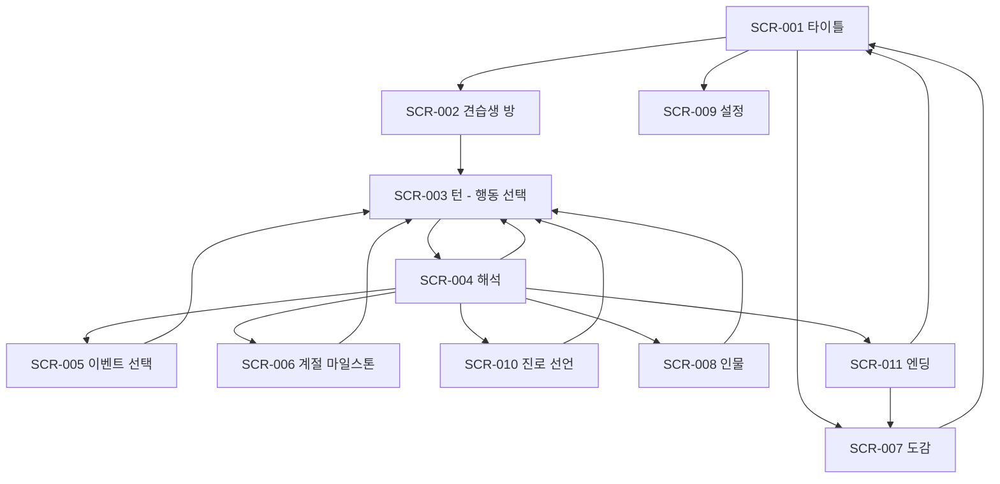

# UI UX 명세

- 문서 상태: `draft`
- 작성일: 2026-08-23
- Source of truth: 이 문서가 화면 계약, 상태 매트릭스, 피드백 채널, 접근성 기준을 소유한다. 규칙과 수식은 `02-gdd.md`.
- 관련: [[02-gdd]] · [[04-art-audio-bible]]

## 내비게이션 그래프

**규칙**
- 뒤로가기는 항상 상위 노드로만 간다. `SCR-004` 해석 중에는 뒤로가기가 없다(연출 0.3초 스킵만).
- **AppsInToss에서는 운영체제 뒤로가기 제스처를 쓸 수 없다**(SRC-001). 모든 화면에 화면 내 이탈 경로가 있어야 하고, 미니앱 종료 시 확인 모달을 띄운다.
- 진입 직후 바텀시트를 자동으로 띄우지 않는다(SRC-001).

## 디자인 시스템

| 토큰 | 값 | 용도 |
|---|---|---|
| `--bg-night` | `#161B2D` | 기본 배경 (밤하늘) |
| `--bg-panel` | `#1E2540` | 패널 |
| `--ink` | `#F4F1E8` | 본문 텍스트 |
| `--ink-dim` | `#A9B2C7` | 보조 텍스트 |
| `--gold` | `#F2C75C` | 강조·주 CTA |
| `--teal` | `#3E8E8A` | 성공·성장 |
| `--rose` | `#D97A7A` | 실패·비용 |
| `--outline` | `#0E1120` | 일러스트 아웃라인 (굵기 3~4px @720w) |

- 기준 해상도 **720×1280**, `stretch_mode=canvas_items`, `aspect=expand`.
- 타이포 스케일: 표제 40 / 소제목 28 / 본문 24 / 보조 19 / 최소 **17**. 720 기준 px.
- 터치 타깃 최소 **88×88** (720 기준 = 44dp 상당). 카드 간 간격 최소 16.
- 텍스트는 전부 엔진 폰트로 렌더한다. **이미지에 글자를 굽지 않는다.**

## 화면 계약

각 화면은 목적 / 시선 우선순위 / 주·보조 행동 / 분석 이벤트를 갖는다.

### SCR-003 턴 — 행동 선택 (메인 플레이 화면)

> **org 하드 게이트 대응.** 현행 구현은 14개 스탯 카드 그리드가 화면을 지배하는 금지된 dashboard 구성이다. 이 화면이 그것을 대체한다.

| 항목 | 내용 |
|---|---|
| 목적 | 이번 턴에 무엇을 할지 고르게 한다 |
| 진입 | 방(SCR-002) 또는 직전 해석(SCR-004) |
| **시선 1** | **장면 — 상단 62%.** 플랫 일러스트 배경 + 견습생 피겨 + 현장 NPC. 시기는 프로그레스 바가 아니라 **손글씨 명패**("3월 중순") |
| **시선 2** | **선택 밴드 — 하단 30%.** 일러스트 행동 카드 4~6장. **카드당 숫자 최대 2개** (주 스탯 델타 + 기력 비용), 아이콘+숫자 쌍으로만 |
| **시선 3** | **자원 핍 — 우측 가장자리.** 금화·기력·마음 토큰 + 견습생 초상. **초상의 표정이 마음 수치의 1차 표시** |
| 주 행동 | 카드 탭 → 확정 |
| 보조 행동 | `함께` NPC 칩 탭(확정 전), 초상 탭 → 별자리 시트, 카드 롱프레스 → 상세 |
| 금지 | 스탯 표, 델타 이중 표시, 숫자 카드 그리드 |
| 분석 | `turn_started`, `action_selected`, `together_attached` |

### SCR-004 해석

| 항목 | 내용 |
|---|---|
| 목적 | 선택의 인과를 보여준다 |
| 길이 | 1.5~2.0초. **탭하면 0.3초로 스킵** |
| 연출 | 카메라 push-in → 행동 비트 1회 → 해당 별자리 점 발광 → 숫자 1개 팝 → 결과 문장이 장면 위에 타이핑 |
| **화면 전환** | **없음.** SCR-003 위에서 그대로 재생된다 |
| 분석 | `turn_resolved` (outcome, stat, delta) |

### SCR-005 이벤트 선택

| 항목 | 내용 |
|---|---|
| 시선 1 | 이벤트 일러스트 + 제목 |
| 시선 2 | 본문 60~140자 |
| 시선 3 | 선택지 2~4개 |
| 규칙 | **미충족 선택지를 숨기지 않는다.** 회색 처리 + `locked_reason` 노출 |
| 분석 | `event_shown`, `event_choice_made`, `event_choice_locked_seen` |

### SCR-006 계절 마일스톤

| 항목 | 내용 |
|---|---|
| 목적 | 실제 합격/불합격을 통보 |
| 연출 | 점수 집계 → 난이도 라인 대비 → 장원/급제/낙방 |
| 상태 | 낙방 2회째에는 **낙제 확정 경고**를 명시한다 |
| 분석 | `milestone_result` (season, grade, score, difficulty) |

### SCR-011 엔딩

| 항목 | 내용 |
|---|---|
| 시선 1 | 엔딩 일러스트 + 칭호 |
| 시선 2 | 엔딩 본문 |
| 시선 3 | 별조각 정산 · 도감 신규 해금 · 공유 |
| 보조 | 보상형 광고(별조각 +50%), 전면 광고는 **공유 직후 1회** |
| 분석 | `run_completed` (ending_code, band, turns, seed_hash) |

### SCR-007 도감

30종 그리드. 미해금은 실루엣 + 힌트. **band 색으로 희소도를 표시**한다. 해금된 진로는 다음 런 선언 메뉴에 추가됨을 명시한다.

### SCR-002 견습생 방 / SCR-008 인물 / SCR-009 설정 / SCR-010 진로 선언

- **SCR-002**: 진행률, 재능 프로필, 이번 달 목표. 스탯 나열 금지 — 별자리 진입점만.
- **SCR-008**: NPC 6명 초상 + 호감 밴드 + 해금 조건. 미개방 NPC는 실루엣.
- **SCR-009**: **사운드 On/Off 필수**(SRC-001), 감소된 모션, 데이터 초기화, 개인정보처리방침 링크.
- **SCR-010**: 월 7 필수 진로 선언. 3개 경로 카드 + 각각이 여는 엔딩 band 표시.

## 상태 매트릭스

행동 카드 기준.

| 상태 | 시각 | 조건 |
|---|---|---|
| default | 일러스트 + 아웃라인 | 선택 가능 |
| pressed | 스케일 0.96 + 아웃라인 굵어짐 | 탭 중 |
| selected | 금색 테두리 + 살짝 부상 | 확정 대기 |
| disabled | 채도 40% + 사유 칩 | 자원 부족 |
| locked | 자물쇠 + 해금 조건 | 티어 미해금 |
| loading | 스켈레톤 | 콘텐츠 로드 중 |
| empty | — | 발생 불가(항상 최소 2장 보장) |
| error | 토스트 + 재시도 | 저장 실패 |
| offline | 배지 없음 | 오프라인이 기본 동작이라 표시하지 않음 |
| success | 별자리 점 발광 + 숫자 팝 | 해석 성공 |

## 피드백과 게임 필

**숫자만 바뀌는 피드백은 실패로 본다.** 모든 핵심 행동은 최소 2개 채널을 쓴다.

| 행동 | 시각 | 청각 | 촉각 |
|---|---|---|---|
| 카드 탭 | 스케일 0.96 | 클릭 | light |
| 확정 | 카드 부상 + 장면 push-in | 확정음 | medium |
| 성공 | 별자리 점 발광 + 숫자 팝 | 상승음 | light |
| 대성공 | 화면 가장자리 금색 플래시 + 파티클 | 팡파르 짧게 | medium |
| **각성** | 별자리 전체 점멸 + 화면 흔들림 | 전용 스팅어 | heavy |
| 실패 | 로즈 톤 비네트 + 피겨 어깨 처짐 | 하강음 | medium |
| 상태이상 진입 | 화면 채도 감소 지속 | 저역 드론 | heavy |
| 마일스톤 낙방 | 명패 균열 | 정적 후 단음 | heavy |

**AppsInToss 제약 반영**(SRC-001): 사운드 On/Off 설정 필수, 백그라운드 전환 시 즉시 종료·복귀 시 재생, 광고 재생 중 음악 일시정지·종료 후 재개, **인터랙션 반응 2초 초과 금지**.

## 접근성

- 최소 폰트 17px(720 기준). **핀치 줌을 막지 않는다** — 현행 구현의 `user-scalable=no`는 승계하지 않는다.
- 텍스트 대비 4.5:1 이상. **패널은 반투명으로 두지 않는다** — 현행은 캔버스 위 반투명 패널이라 대비가 화면마다 달랐다.
- `감소된 모션` 설정 시 카메라 push-in·파티클·흔들림을 끄고 결과 문장만 즉시 표시한다.
- 색만으로 정보를 전달하지 않는다. 성공/실패는 색 + 아이콘 + 문장.
- 포커스 이동을 관리한다. 화면 전환 시 첫 인터랙티브 요소로 포커스를 옮긴다.
- 엔딩·이벤트 본문은 스크린리더가 한 번에 읽도록 하나의 라이브 리전으로 노출하고, **턴마다 전체 화면을 재낭독하지 않는다**(현행 결함).

## 반응형 기기 매트릭스

| 구분 | 해상도 | 비율 | 확인 항목 |
|---|---|---|---|
| 최소 | 720×1280 | 16:9 | 카드 4장이 잘리지 않음 |
| 대표 | 1080×2340 | 19.5:9 | 장면 62% 유지 |
| 최대 | 1284×2778 | 19.5:9 | 여백 과다 없음 |
| 노치/펀치홀 | — | — | Safe Area 침범 금지(SRC-001) |
| 태블릿 | 1536×2048 | 4:3 | 세로 고정, 좌우 레터박스 허용 |

**세로 고정.** `handheld/orientation=1`.

## 첫 세션 스토리보드

| 시각 | 화면 | 플레이어가 보는 것 |
|---|---|---|
| 0:00 | SCR-001 | 밤하늘, 타이틀, `새로 시작` |
| 0:05 | 생성 | 이름 입력 + **재능 개봉** — S/D 등급이 별자리에 순차 점등 |
| 0:45 | SCR-003 | 첫 행동 카드 4장. 명패 "1월 상순" |
| 0:52 | SCR-004 | 첫 해석 — 별자리 점 1개 발광, 숫자 +8 팝 |
| 1:10 | SCR-005 | 개막 이벤트. 재능에 따라 분기된 본문 |
| 1:40 | SCR-003 | 세라 `함께` 칩 최초 등장 — 튜토리얼 문구 1줄 |
| 2:30 | SCR-003 | 이든 등장 |
| 3:20 | 월말 배너 | 수업료 40금화 청구 — 자원 구속을 처음 체감 |
| 4:40 | SCR-006 | 첫 계절 마일스톤 |

**별도 튜토리얼 화면을 만들지 않는다.** 첫 3턴의 콘텐츠가 가르친다.

## UI 인수 증거

| # | 증거 | 판정 |
|---|---|---|
| E1 | SCR-003 주석 스크린샷 | 장면 62% / 선택 밴드 30% 비율 충족, 스탯 표 부재 |
| E2 | 360dp급 실기기 스크린샷 | 카드 텍스트 잘림 없음, 하단 CTA가 콘텐츠를 가리지 않음 |
| E3 | 해석 비트 영상 | 1.5~2.0초, 화면 전환 없음, 탭 스킵 0.3초 |
| E4 | 상태 매트릭스 시트 | 10개 상태 전부 렌더 |
| E5 | `tests/layout_probe.tscn` 로그 | 모든 버튼 88px 이상, Safe Area 침범 0 |
| E6 | 감소된 모션 비교 영상 | 모션 제거 후에도 정보 손실 없음 |
| E7 | AIT QR 샌드박스 영상 (Android/iOS 각각) | 최초 화면 10초 이내, 한국어 렌더 정상 |
