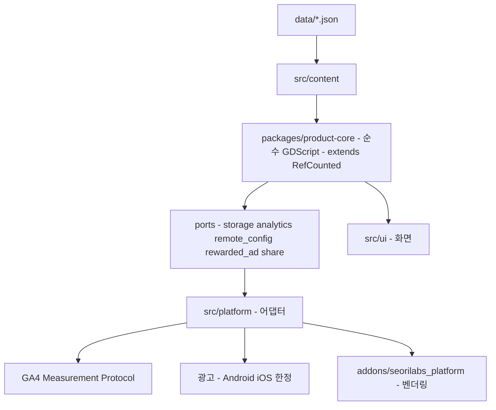

# 기술 제작 계획

- 문서 상태: `draft`
- 작성일: 2026-08-23
- Source of truth: 이 문서가 엔진 선택, 계층 경계, 데이터 계약, 분석 이벤트 분류, 성능 예산, 저장 마이그레이션을 소유한다. 단계별 실행 순서와 리포 재구성 절차는 승인된 계획 파일이 소유한다.
- 관련: [[02-gdd]] · [[07-qa-launch-plan]]

## 아키텍처와 엔진

| 항목 | 값 | 근거 |
|---|---|---|
| 엔진 | **Godot `4.7.2.stable`** (`.godot-version` 핀) | org 최근 론칭 2개(spiritgate·jomul)와 동일. 4.7.2 export template 로컬 설치 확인 |
| 언어 | GDScript (strict typing) | org 표준 |
| `project.godot` 위치 | **레포 루트** | 론칭 3개 게임 전부 루트. org 재사용 워크플로우 기본값 `project_dir: "."` |
| 뷰포트 | 720×1280, `canvas_items`, `expand`, `orientation=1` | 같은 한국어 텍스트 중심 게임인 jomul과 동일 |
| 렌더러 | `mobile` | 단 iOS WebKit 검증 필요 — [[01-research-dossier]] 부록 B (R17) |
| Web thread support | **`false`** | Godot 4.3부터 기본값. COOP/COEP 요구를 없애 호환성이 높다 (SRC-012) |



**경계 규칙 (문서가 아니라 CI가 강제한다)**

`packages/product-core/`는 `extends RefCounted`만 쓴다. 금지: `Node`/`Control`/`SceneTree`/`Engine`/`Input`/`DisplayServer`, `FileAccess`/`DirAccess`/`ResourceLoader`/`ProjectSettings`, `OS`/`Time`/`JSON`, `preload()`/`load()`, Firebase·광고·결제·`JavaScriptBridge`·HTTP.

자주 걸리는 두 가지:
- **`JSON` 금지** → 콘텐츠 파싱은 `src/content/`가 하고 코어는 `Dictionary`만 받는다.
- **`Time` 금지** → 시간 의존은 전부 주입 인자다. 이것이 밸런스 하네스를 결정론적으로 만든다.

정규식으로는 이 경계를 잡을 수 없다. GDScript에는 import 문이 없고 의존이 `extends`/`preload()`/싱글턴 이름으로 들어오며 한국어 주석이 오탐을 만든다. `tools/check_core_boundary.py`(Python)가 검사한다.

**autoload 순서 = 로드 순서**: `Events` → `Ui` → `GameData` → `Platform` → `Profile` → `Audio`.
`Ui`가 **import 이후에** 한국어 폰트를 `get_tree().root.theme`에 부착한다. `project.godot`에 `gui/theme/custom_font`를 넣지 않는다 — 부팅 시점 로드가 첫 import보다 앞서 clean 체크아웃마다 `ERROR`를 남기고 required check가 영구히 red가 된다.

## 데이터 계약

콘텐츠는 코드가 아니라 `data/*.json`이다.

| 파일 | 내용 |
|---|---|
| `data/actions.json` | 액션 38종 (id, 계열, 티어, 비용, 스탯 효과, `npc_tag`, 해금 조건) |
| `data/events.json` | 이벤트 106종 + 선택지 286 + 결과문 429 |
| `data/endings.json` | 엔딩 30종 (요건, band, `score_terms`) |
| `data/npcs.json` | NPC 6명 (밴드 임계값, 게이트, 담당 계열) |
| `data/route_plans.json` | 밸런스 하네스용 36턴 루트 30종 |
| `i18n/translations.csv` | `keys,ko` — 모든 표시 문자열 |

**문자열은 콘텐츠 JSON에 직접 넣지 않고 i18n 키로 참조한다.** 한국어 전용 출시지만 구조를 선반영해, 나중에 영어 추가가 텍스트 작업만으로 끝나게 한다.

저장 레코드도 렌더된 문자열이 아니라 `{schema, turn, i18n_key, args}`를 담는다.

## 분석 이벤트 분류

질문 → KPI → 이벤트 순으로 설계한다.

| 질문 | KPI | 이벤트 | 주요 파라미터 |
|---|---|---|---|
| 첫 세션을 넘기는가 | 활성화율 | `first_launch`, `run_started`, `turn_resolved` | `platform`, `release_version`, `turn` |
| 완주하는가 | 1회차 완주율 | `run_completed` | `ending_code`, `band`, `turns`, `duration_s` |
| 어디서 이탈하는가 | 턴별 이탈 | `turn_resolved` | `turn`, `condition`, `gold`, `energy`, `stress` |
| 다시 하는가 | 2회차 진입률 | `run_started` | `run_index` |
| 선택이 다양한가 | 선택지 분포 | `event_choice_made` | `event_id`, `choice_id`, `locked_shown` |
| 관계를 쓰는가 | `함께` 사용률 | `together_attached` | `npc_id`, `turn` |
| 무너지는가 | 상태이상 진입률 | `condition_entered` | `condition`, `turn` |
| 광고가 먹히는가 | 노출·완주 | `ad_requested`, `ad_view`, `ad_rewarded` | `placement`, `result` |
| 깨지는가 | 오류율 | `script_error` | `file`, `line`, `class` |

**구조적 제약과 대응** — GA4 Web 스트림 + Measurement Protocol이라:
- 전 트래픽이 `platform=web`으로 뭉개진다 → **모든 이벤트에 `platform` 파라미터를 싣고, GA4에 이벤트 범위 커스텀 측정기준으로 등록한다. 등록은 첫 이벤트 전에 해야 하고 소급되지 않는다.**
- MP가 `first_open`/`first_visit`/`session_start`를 거부해 `newUsers`·`engagedSessions`가 영구 0이다 → 자체 `first_launch` 이벤트로 잔존율을 재구성한다.
- `session_id`와 `engagement_time_msec`을 클라이언트가 합성한다.

전송은 `user://` jsonl 영속 큐 + 재시도. 오프라인에서도 손실되지 않는다.

## 성능 예산

| 항목 | 예산 | 근거 |
|---|---:|---|
| **AIT 최초 화면 도달** | **≤ 10초** | AppsInToss 필수 요건 (SRC-001) |
| **총 전송량** | **≤ 15 MB gzip** | [[01-research-dossier]] 부록 A |
| — 엔진 wasm | ~9 MB (고정) | 실측. `.wasm`은 gzip으로 약 1/4 (SRC-012) |
| — pck | **≤ 6 MB gzip** | 에셋 매니페스트를 구속한다 |
| `.ait` 압축 해제 | ≤ 100 MB | AIT 하드 리밋 |
| 인터랙션 응답 | < 2초 | AppsInToss 필수 (SRC-001) |
| 턴 해석 연출 | 1.5~2.0초 (스킵 0.3초) | 설계 목표 |
| 밸런스 하네스 | 210루트 7,560턴 < 1초 헤드리스 | required check로 둘 수 있는 조건 |
| 프레임 | 60fps 목표 / 30fps 하한 | 저사양 실기기 |

**wasm 9 MB를 낮추는 유일한 수단**은 "사용하지 않는 기능을 끈 최적화 export template 컴파일"이다(SRC-012). P3 이후 필요 시 적용한다.

## 저장 마이그레이션

현행은 버전 필드만 있고 **마이그레이션 함수가 없다**. 스키마가 바뀌면 런이 조용히 소실된다. 이번에는 실제 마이그레이션을 만든다.

| 규칙 | 내용 |
|---|---|
| 버전 | `save_schema_version` 정수. 증가만 한다 |
| 마이그레이션 | `migrate_v{n}_to_v{n+1}(dict) -> dict` 체인. 각 단계에 단위 테스트 |
| 미지원 하위 버전 | 명시적으로 거부하고 사용자에게 알린다. 조용히 삭제하지 않는다 |
| 손상 | 필드 단위 클램프 → 복구 가능한 접두사까지 되감기 → 그래도 안 되면 알림 후 신규 |
| 미래 버전 | 앱이 더 낮으면 강제 업데이트 안내 |
| 슬롯 | 런 1개 + 메타(도감·별조각·각인·명부) 별도 키 |

**AppsInToss 요구사항**(SRC-001): 사용자 식별키로 플레이 기록이 유지되고, 미니앱 종료 후 재접속에도 데이터가 남아야 한다.

## 백엔드와 보안 경계

- **서버 권위 없음.** 게임 규칙·판정·저장은 전부 클라이언트 로컬이다.
- 네트워크는 둘뿐이다: GA4 분석 전송, 광고 로드(Android/iOS).
- `analytics.config.json`(measurement_id + api_secret)은 **gitignore**하고 CI가 복원한다. **Pages export에서 제외**해 프리뷰가 스트림을 오염시키지 않게 한다.
- service account JSON·private key·Admin SDK 자격증명을 클라이언트에 넣지 않는다.
- **외부에서 전달받은 코드를 실행하지 않는다**(AppsInToss 정책, SRC-001). `JavaScriptBridge.get_interface(...)`만 쓰고 `.eval(...)`은 금지한다. Godot 웹 로더의 `_godot_js_eval` shim은 빌드 시 fail-closed로 치환하고, 완성된 `.ait`를 재스캔한다.
- API는 HTTPS만. WebSocket은 쓰지 않는다.
- 개인정보를 수집하지 않는다. 분석은 익명 식별자와 게임 진행 파라미터만 보낸다.

## 플랫폼 연동

| 타깃 | 경로 | 비고 |
|---|---|---|
| Google Play | Godot Android export → 서명 AAB → Play Developer API (WIF) | **org secrets 재사용, 새 keystore 생성 금지**. `com.seorilabs.starlitapprentice` 승계 |
| Apple App Store | Godot iOS export → Xcode 아카이브 | GitHub `macos-26` vs Xcode Cloud — **미정** |
| AppsInToss | Godot Web export → `@apps-in-toss/web-framework` 래핑 → `.ait` | 로더 sanitize + 코드실행 스캔 + 크기 2중 게이트 + pck 폰트 검증 |
| 분석 | GA4 Measurement Protocol (GDScript HTTP) | 네이티브 SDK 이관 시 어댑터 1개만 교체 |
| Platform SDK | `addons/seorilabs_platform` 파일 벤더링 + CHECKSUM 게이트 | 광고 보상 `server_verified` 검증 |

**순서 제약**: AppsInToss 출시는 **Google Play / App Store의 IARC 연령등급 취득 이후**다. AIT 콘솔에 자체등급분류 게임물 정보를 입력해야 하고, 미입력 시 등급미필 게임물로 간주된다([[01-research-dossier]] SRC-002, SRC-003).

## 제작 단계

| 단계 | 종료 기준 |
|---|---|
| P0 설계 팩 | 이 문서 세트 + 사용자 승인 |
| P1 오프레포 | GitHub repo, 레지스트리, Firebase/GA4, **커스텀 측정기준 등록**, 등급 경로 착수 |
| P2 재구성 | legacy 격리, 의식 제거, docs 원장. `pnpm legacy:all` 초록 |
| P3 Godot 골격 | `rm -rf .godot` 후 게이트 **2회** 통과 + **AIT 로드 시간 선측정** |
| P4 코어 | 콘텐츠 이식 → 하네스가 옛 판정 재현 → 재설계 → legacy 삭제. 불변식 1~17 |
| P5 런타임 | 11개 화면 smoke 통과 |
| P6 콘텐츠 | 이벤트 106종 저작. 불변식 10·11·17 |
| P7 아트/사운드 | 승인 게이트 G1~G6 |
| P8 플랫폼 | SDK·분석·광고. DebugView에 `platform` 확인 |
| P9 AIT + CI | 4중 게이트, 워크플로우, 브랜치 보호 |
| P10 서명/마켓 | 미확정 스토어 필드 0건 |
| P11 출시 | 심사·공개·live smoke |

**P6(이벤트 42,930자)이 최장 경로다. P4와 병렬로 착수한다.**

## 빌드와 테스트 명령

```bash
# 코어 순수 테스트 (헤드리스)
bash scripts/test_core.sh

# 밸런스 하네스 — 30루트 × 7시드
bash scripts/test_balance.sh

# 경계 · 문서 구조
bash scripts/check_architecture.sh
bash scripts/check_docs.sh

# Godot import → compile → smoke (로그에 ERROR 있으면 실패)
bash scripts/godot_quality_gate.sh --project . --smoke-scene res://tests/test_runner.tscn

# 콘텐츠 정적 린트 (시뮬레이션 없이 모든 콘텐츠 PR을 게이트)
python3 tools/validate_content.py .

# 설계 팩 구조 검증
python3 ~/.claude/skills/game-planning-production/scripts/validate_design_pack.py docs/game-design

# 마켓 빌드
bash scripts/export_godot_android.sh
bash scripts/export_godot_ios.sh
bash scripts/export_godot_web.sh

# AIT 4중 게이트
cd apps/ait && npm run build
godot --headless --main-pack build/web/index.pck --script tools/verify_font_in_pack.gd

# 릴리스 준비 상태
bash scripts/check_release_readiness.sh
```

**Godot은 GDScript 파스 에러에도 exit 0을 낸다.** 모든 Godot 호출을 `timeout`으로 감싸고, **ANSI 코드를 제거한 뒤** `^(SCRIPT ERROR|ERROR):`를 grep해 걸리면 실패시킨다. ANSI 제거를 빼먹으면 색이 입혀진 줄이 매칭되지 않아 게이트 전체가 조용히 무력화된다.
