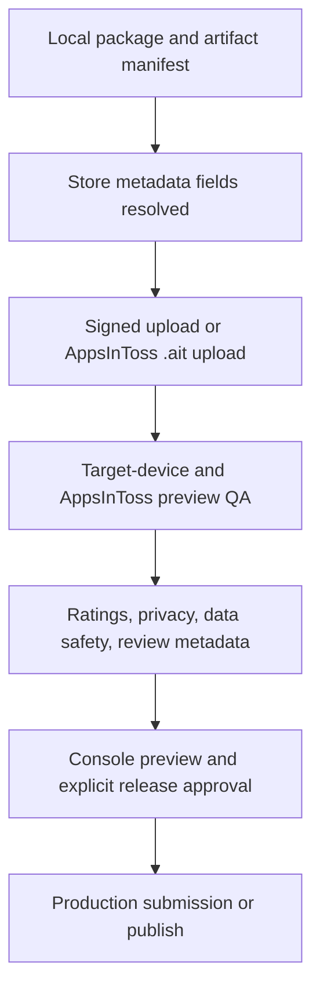

# Release Gate Dashboard

This file is generated from release artifacts, manual QA evidence, console evidence, and store configs.

## Build Identity

| Field | Value |
| --- | --- |
| App | `starlit-apprentice` |
| Version | `0.1.0` |
| Manifest generated | `2026-06-19T08:36:09.203Z` |
| Manual QA build ID | `sha256:ab844098720ce98597f74a71d87fa5493b569906c16e5278fcca17346679cecc` |
| Release decision | `not-a-release-candidate` |

## Gate Summary

| Gate area | Source | Passed | Open | Failed | Blocked |
| --- | --- | ---: | ---: | ---: | ---: |
| Manual target-device QA | `qa/manual-qa-evidence.json` | 0 | 12 | 0 | 0 |
| Release console evidence | `qa/release-console-evidence.json` | 0 | 14 | 0 | 0 |
| Store unresolved fields | store config JSON | 0 | 19 | 0 | 0 |
| Store invalid public URL fields | store config JSON | 1 | 0 | 0 | 0 |
| Final release approval | `qa/release-approval-evidence.json` | 0 | 1 | 0 | 0 |

## Release Flow



## Current Stop Rules

- Do not submit store metadata while store config fields still contain `확정 필요`.
- Do not paste privacy/support/marketing placeholder URLs; host `public-pages/*` on a confirmed HTTPS domain first.
- Do not claim a release candidate while target-device manual QA evidence is incomplete.
- Do not mark a multi-target manual QA item `passed` until every `targetEvidence[]` entry for that item is `passed`.
- Do not mark `native-share` target evidence `passed` unless `targetEvidence[].receivedShareUrl` is the actual recipient URL, public HTTPS without username/password credentials, canonical with only `?ending=<known product-core ending code>`, and has no extra query parameters or hash fragment.
- Do not submit or publish production versions while console upload/review evidence is incomplete.
- Do not mark dependent console evidence `passed` before its prerequisite console evidence items are also `passed`.
- Do not submit review, publish production, or start rollout while `qa/release-approval-evidence.json` is not `approved` for the current `manualQaBuildId`.
- Do not mark evidence `passed` unless it is tied to the current `manualQaBuildId` and includes at least one screenshot, recording, or stable console reference.

## Next Actions

1. **Resolve store metadata fields**: Fill contact, policy URL, SKU, rating, and console-only fields in the target store configs before copy/paste submission.
2. **Host public release pages**: Use `public-pages/index.html`, `public-pages/privacy-policy.html`, and `public-pages/support.html` as static source files after the final HTTPS domain is confirmed.
3. **Upload platform artifacts**: Upload the AppsInToss .ait, signed Google Play AAB, and signed App Store archive where account credentials are available.
4. **Run target-device QA**: Use the generated packets to capture Android/iOS/AppsInToss preview evidence for every open target against the current Manual QA build ID.
5. **Complete rating gates**: Use `qa/rating-content-inventory.md`, then complete store-specific content/age/Korea game rating evidence from the real console or rating authority flow.
6. **Submit privacy declarations**: Submit repo-prepared Data Not Collected/privacy/export evidence in Play Console and App Store Connect.
7. **Preview and request review**: Preview uploaded build plus listing/declarations together, then request review only after explicit approval evidence exists.
8. **Record final release approval**: After every manual QA, console evidence, store field, and preview gate is clear, fill `qa/release-approval-evidence.json` and attach a stable approval reference.

## Open Manual QA Items

- `target-device-pacing` (Google Play, App Store, AppsInToss) - Target-device 1-month and 3-month pacing feel - `pending`
- `target-device-readability` (Google Play, App Store, AppsInToss) - Target-device event and ending readability - `pending`
- `native-share` (Google Play, App Store) - Target-device native share sheet and recipient handoff - `pending`
- `native-webview-back-reload` (Google Play, App Store, AppsInToss) - Target-device WebView back and reload behavior - `pending`
- `apps-in-toss-preview` (AppsInToss) - AppsInToss QR/Toss-app preview - `pending`

## Open Manual QA Targets

- `target-device-pacing/Google Play` - Target-device 1-month and 3-month pacing feel - `pending`
- `target-device-pacing/App Store` - Target-device 1-month and 3-month pacing feel - `pending`
- `target-device-pacing/AppsInToss` - Target-device 1-month and 3-month pacing feel - `pending`
- `target-device-readability/Google Play` - Target-device event and ending readability - `pending`
- `target-device-readability/App Store` - Target-device event and ending readability - `pending`
- `target-device-readability/AppsInToss` - Target-device event and ending readability - `pending`
- `native-share/Google Play` - Target-device native share sheet and recipient handoff - `pending`
- `native-share/App Store` - Target-device native share sheet and recipient handoff - `pending`
- `native-webview-back-reload/Google Play` - Target-device WebView back and reload behavior - `pending`
- `native-webview-back-reload/App Store` - Target-device WebView back and reload behavior - `pending`
- `native-webview-back-reload/AppsInToss` - Target-device WebView back and reload behavior - `pending`
- `apps-in-toss-preview/AppsInToss` - AppsInToss QR/Toss-app preview - `pending`

## Open Console Items

- `apps-in-toss-ait-upload` (AppsInToss) - AppsInToss .ait console upload - `pending`
- `apps-in-toss-qr-preview` (AppsInToss) - AppsInToss QR/Toss-app preview evidence - `pending`
- `apps-in-toss-category-exposure` (AppsInToss) - AppsInToss game category and exposure settings - `pending`
- `apps-in-toss-game-rating` (AppsInToss) - AppsInToss game rating evidence - `pending`
- `apps-in-toss-deployment-approval` (AppsInToss) - AppsInToss deployment approval - `pending`
- `google-play-signed-aab-upload` (Google Play) - Google Play signed AAB upload - `pending`
- `google-play-content-rating` (Google Play) - Google Play content rating questionnaire - `pending`
- `google-play-korea-game-rating` (Google Play) - Google Play Korea game rating evidence - `pending`
- `google-play-data-safety` (Google Play) - Google Play Data safety console submission - `pending`
- `google-play-track-preview` (Google Play) - Google Play track choice and store preview - `pending`
- `app-store-signed-build-upload` (App Store) - App Store signed archive upload - `pending`
- `app-store-age-rating` (App Store) - App Store age rating questionnaire - `pending`
- `app-store-privacy-export` (App Store) - App Store privacy and export compliance submission - `pending`
- `app-store-review-metadata` (App Store) - App Store review metadata and submission - `pending`

## Unresolved Store Fields

- AppsInToss: `manualEvidence.consoleGameCategoryAndExposure` = 확정 필요
- AppsInToss: `manualEvidence.gameRatingEvidence` = 확정 필요
- AppsInToss: `manualEvidence.aitBundleUpload` = 확정 필요
- AppsInToss: `manualEvidence.qrTossAppTest` = 확정 필요
- AppsInToss: `manualEvidence.deploymentApproval` = 확정 필요
- Google Play: `privacyPolicyUrl` = 확정 필요
- Google Play: `contentDeclarations.contentRating` = 확정 필요 - IARC 및 한국 게임 등급 증빙 필요
- Google Play: `contentDeclarations.koreaGameRating` = 확정 필요 - Play Console 또는 게임물관리위원회 증빙 필요
- Google Play: `manualEvidence.androidAppBundle` = 확정 필요
- Google Play: `manualEvidence.playConsoleListing` = 확정 필요
- Google Play: `manualEvidence.policyQuestionnaire` = 확정 필요
- App Store: `sku` = 확정 필요
- App Store: `contact.firstName` = 확정 필요
- App Store: `contact.lastName` = 확정 필요
- App Store: `contact.phone` = 확정 필요
- App Store: `privacyPolicyUrl` = 확정 필요
- App Store: `supportUrl` = 확정 필요
- App Store: `marketingUrl` = 확정 필요
- App Store: `reviewDeclarations.ageRating` = 확정 필요 - App Store Connect 연령 등급 설문 입력 필요

## Invalid Public URL Fields

- none

## Handoff Files

| File | Purpose |
| --- | --- |
| `qa/manual-qa-packet.md` | Target-device QA steps and evidence snippets |
| `qa/release-console-packet.md` | Console upload/review steps and evidence snippets |
| `qa/rating-content-inventory.md` | Repo-local content inventory for rating questionnaires |
| `qa/public-release-pages.md` | Hostable privacy/support/marketing page mapping and unresolved URL fields |
| `qa/store-submission-packet.md` | Copy/paste metadata, asset paths, hashes, and unresolved console fields |
| `qa/release-gate-dashboard.md` | Release decision, dependency order, and open gate summary |
| `qa/release-approval-packet.md` | Final explicit release approval handoff and stop rules |

## Verification Commands

```bash
pnpm check:release-packages
pnpm build:apps-in-toss:candidate
pnpm check:package
pnpm release:artifact-manifest
pnpm check:release-artifact-manifest
pnpm check:release-verification-commands
pnpm check:release-manual-blockers
pnpm check:public-url-guard
pnpm release:manual-qa-packet
pnpm check:manual-qa-packet
pnpm release:console-packet
pnpm check:release-console-packet
pnpm release:rating-content-inventory
pnpm check:rating-content-inventory
pnpm release:public-pages
pnpm check:public-pages
pnpm release:store-submission-packet
pnpm check:store-submission-packet
pnpm release:gate-dashboard
pnpm check:release-gate-dashboard
pnpm release:approval-packet
pnpm check:release-approval-packet
pnpm check:release-approval
pnpm check:release:automated
```
